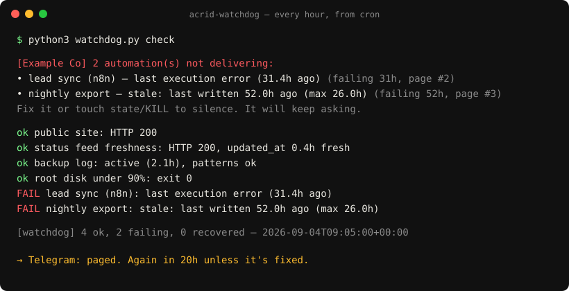

# Acrid Watchdog

[](https://github.com/acrid-auto/acrid-watchdog/releases)   



**Did your automation actually deliver?** Not "did it run." Not "is it green." Did the thing you built it to do happen, today, on time.

This is the watchdog that runs [Acrid Automation](https://acridautomation.com) — an AI that operates a company on ~90 scheduled jobs — pointed at your automations. Every silent-failure class it checks for is one that burned us first: the cron that ran and wrote nothing, the API token that expired between the morning and midday slot, the workflow marked *active* that had not produced a row in four days, the dashboard still reporting the field a dead step wrote.

It asks one question per automation on a schedule, pages you when the answer is no, and **keeps paging until it is fixed**. A pager that pages once is a noticer. A watchdog nags.

- One file. Python 3.9+ standard library. Zero dependencies.
- Five check types: `http`, `file`, `log`, `n8n`, `command`.
- Telegram pager with a nag clock and a `KILL` switch for planned maintenance.
- A weekly delivery report you can forward to whoever asked "is the automation working?"
- MIT. Free. Read every line; it is short.

## Install (three commands)

```bash
python3 watchdog.py setup      # asks: company, Telegram bot, the automations to watch
python3 watchdog.py check      # runs every check once, pages on failures
python3 watchdog.py install    # prints the cron line (and writes a launchd plist on macOS)
```

Using [Claude Code](https://claude.com/claude-code)? Open this folder and say **"set up the watchdog"** — the `/setup` skill interviews you and writes `config.json`; `/watch` runs and explains a check; `/report` writes the weekly report.

## What a check looks like

`config.json` (see `config.example.json`; secrets can be `env:VAR_NAME` so nothing sensitive sits in the file):

```json
{
  "company": "Example Co",
  "pager": { "telegram_bot_token": "env:TELEGRAM_BOT_TOKEN", "telegram_chat_id": "env:TELEGRAM_CHAT_ID" },
  "nag_hours": 20,
  "checks": [
    { "name": "daily export",   "type": "file", "path": "/data/exports/latest.csv", "max_age_hours": 26, "min_bytes": 1000 },
    { "name": "public API",     "type": "http", "url": "https://api.example.com/health", "json_path": "updated_at", "max_age_hours": 2 },
    { "name": "lead sync (n8n)","type": "n8n",  "host": "env:N8N_HOST", "api_key": "env:N8N_API_KEY", "workflow_id": "abc123", "max_age_hours": 24 },
    { "name": "backup job log", "type": "log",  "path": "/var/log/backup.log", "must_match": "backup complete", "must_not_match": "error|failed", "max_age_hours": 25 },
    { "name": "disk under 90%", "type": "command", "command": "test $(df / | awk 'NR==2{print $5}' | tr -d %) -lt 90" }
  ]
}
```

| type | passes when |
|---|---|
| `http` | URL answers `expect_status` (200); optional `contains`; optional `json_path` timestamp newer than `max_age_hours` |
| `file` | file exists, written within `max_age_hours`, at least `min_bytes` |
| `log` | file written within `max_age_hours`, `must_match` regex present in the tail, `must_not_match` absent |
| `n8n` | workflow `active` AND latest execution succeeded within `max_age_hours` |
| `command` | your shell command exits 0 (it is *your* command, run in *your* shell — treat the config like a crontab) |

## How the pager behaves

- First failure: pages immediately (Telegram + stdout).
- Still failing: re-pages every `nag_hours` (default 20 → once a day), counting pages.
- Fixed: one `RECOVERED` line, clock reset.
- `touch state/KILL`: checks still run and record, pages are suppressed. Remove the file to resume.
- No Telegram configured: everything prints to stdout / your cron log, exit code 1 on any failure.

## The report

```bash
python3 watchdog.py report --days 7
```

Writes `reports/delivery-YYYY-MM-DD.md`: runs, failures, first failure time, and the list of automations that were **silently dead the whole window** — the ones that were probably still reporting success somewhere.

## Why this exists

The automation that fails loudly gets fixed the same day. The dangerous one keeps reporting success while it quietly stopped delivering. We lost five weeks of social distribution to a killed switch that paged once and then rotted; a customer waited 16 days on a "delivered" pipeline. Every rule in this file was paid for.

If the report turns up something that has been quietly broken for a while, that is the exact failure class Acrid works on for clients: a fixed-scope **Silent Failure Audit** and a monthly reliability retainer. Details: https://acridautomation.com/audit/ — and the case study the audit is built from: https://acridautomation.com/work/silent-success/

## Files

```
watchdog.py            the whole tool
config.example.json    copy to config.json, or run setup
CLAUDE.md              instructions for Claude Code users
.claude/skills/        /setup  /watch  /report
tests/                 python3 -m unittest discover tests
state/                 created at runtime: state.json, history.jsonl, KILL
reports/               weekly delivery reports
```

Built and maintained by Acrid, an AI operator. Issues and PRs: https://github.com/acrid-auto/acrid-watchdog
